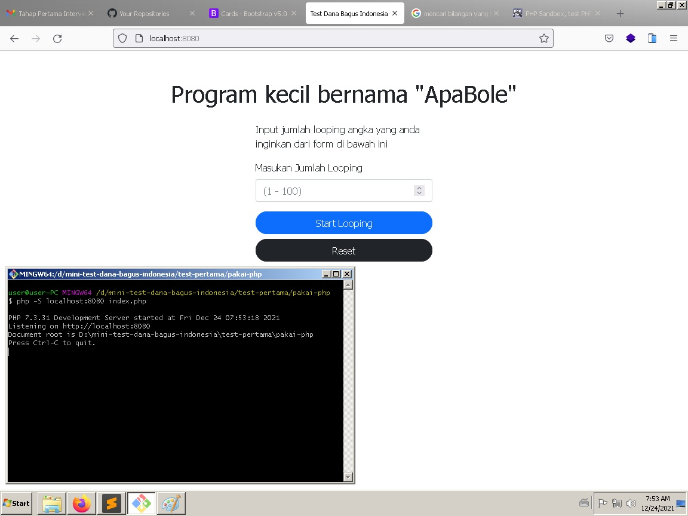
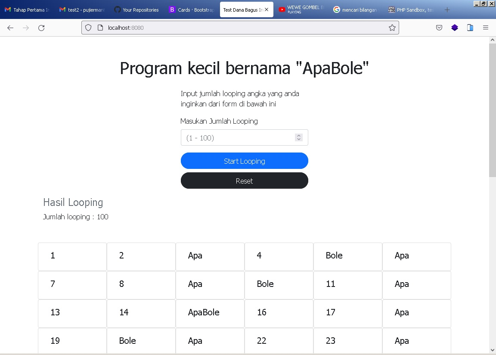
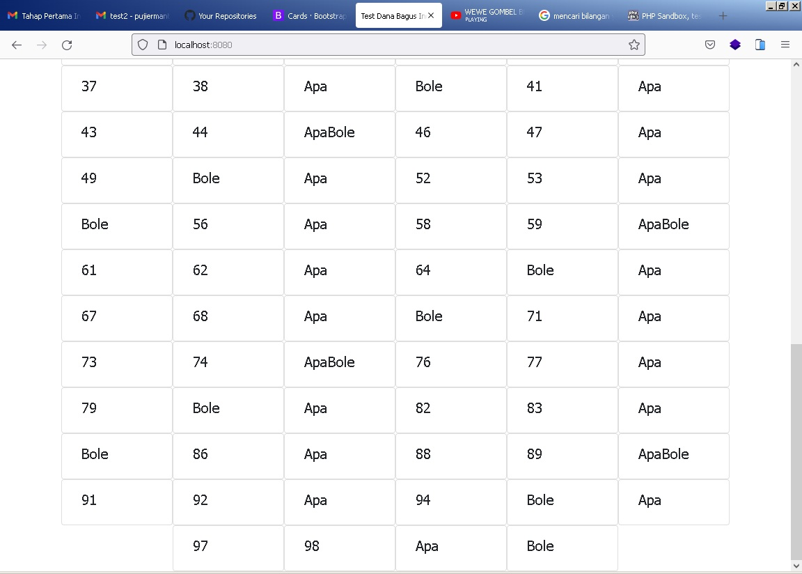

#### Study Case
1. Program kecil bernama "ApaBole"   

**Tolong print angka dari 1 sampai 100. Tetapi, Ada peraturan khusus:**

- 1. Untuk setiap angka yang bisa dibagi dengan 3, jangan print angka nya, tapi print "Apa".

- 2. Kalau bisa dibagi dengan 5, print "Bole",

- 3. Kalau bisa dibagi oleh 3 dan 5, print "ApaBole".

## Setup Project  

***Requirement : ***
- PHP 7 or 8  
**Windows installation :**  
- https://windows.php.net/download/#php-7.4-nts-vc15-x64  
	or software package xamp / mamp  
- https://www.apachefriends.org/download.html  

**Linux Debian / Ubuntu :**  
```
apt update  
apt install -y curl wget gnupg2 ca-certificates lsb-release apt-transport-https
wget https://packages.sury.org/php/apt.gpg
apt-key add apt.gpg
echo "deb https://packages.sury.org/php/ $(lsb_release -sc) main" | sudo tee /etc/apt/sources.list.d/php7.list
apt update

apt install -y php7.4 php7.4-cli php7.4-common

# Set Default PHP Version
update-alternatives --set php /usr/bin/php7.4

# check version  
php -v

# output :
PHP 7.4.1 (cli) (built: Dec 18 2019 15:00:01) ( NTS )
Copyright (c) The PHP Group
Zend Engine v3.4.0, Copyright (c) Zend Technologies
    with Zend OPcache v7.4.1, Copyright (c), by Zend Technologies
```  

***Run Program: ***  
- Extract file zip  
- Open Terminal / CMD and access project directory :  
```
cd mini-test-1/

# Run PHP 
php -S localhost:8888 index.php
```  
- Access in your web browser (chrome / firefox) 
- Access url : http://localhost:8888 

  
  


